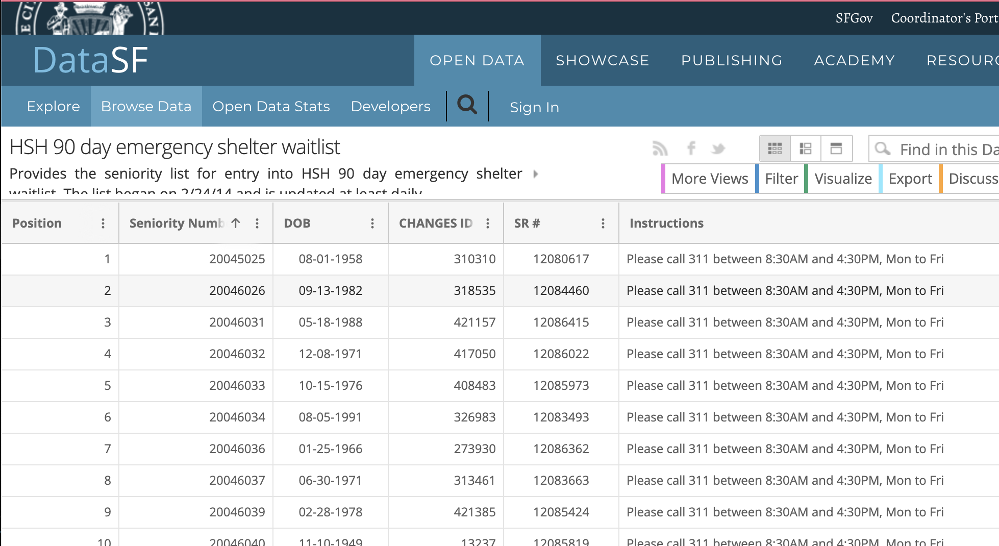

# Daily snapshots of San Francisco's 90-day emergency shelter waitlist

This repo contains a compilation of daily snapshots of [San Francisco's shelter reservation wait-list](https://sf311.org/information/waitlist), which I started collecting on [March 12, 2020](data/collected/2020-03-12_13.csv) – around the time when the city was taking action as a result [of health and housing impacts from COVID-19](https://sf.gov/news/san-francisco-responds-coronavirus-new-directives-and-expanded-resources).

**The compiled data**: [data/wrangled/sf-shelter-waitlist.csv](data/wrangled/sf-shelter-waitlist.csv)




## About the data

Data comes from the city of San Francisco's data portal; the dataset is titled "HSH 90 day emergency shelter waitlist": 

https://data.sfgov.org/Health-and-Social-Services/HSH-90-day-emergency-shelter-waitlist/w4sk-nq57

The blurb:

> Provides the seniority list for entry into HSH 90 day emergency shelter waitlist. The list began on 2/24/14 and is updated at least daily.

> For more information, see https://sf311.org/information/waitlist and http://hsh.sfgov.org/services/emergencyshelter/


Here's an official info brochure titled "How to Get on the 311 Shelter Reservation Waitlist": [local copy](assets/how-to-get-on-shelter-waitlist.pdf) / [online URL](http://hsh.sfgov.org/wp-content/uploads/2017/06/How-to-get-on-311-Waitlist-English-062817.pdf)


-----

## What's in the repo

I run a local cron job that collects the data every day at 8:40PM (CST):

```
40 20 * * * source ~/.bash_profile && cd ~/a/sf-shelter-waitlist/ && ./scripts/collect.py > /dev/null 2>&1 || true
```

The raw daily snapshots can be found in [data/collected](data/collected)


The script [scripts/wrangle.py](scripts/wrangle.py) compiles the snapshots into a single file: [data/wrangled/sf-shelter-waitlist.csv](data/wrangled/sf-shelter-waitlist.csv)
